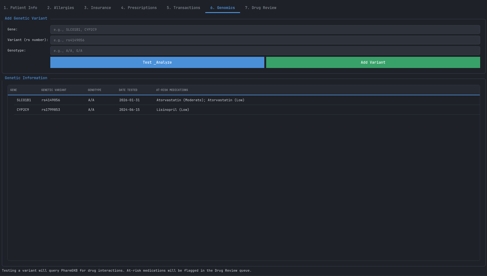
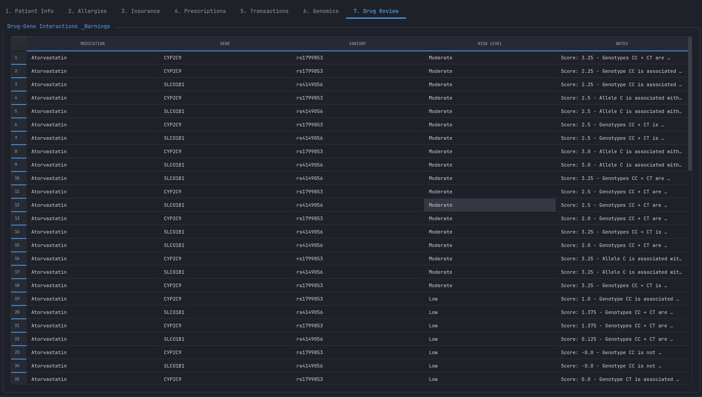
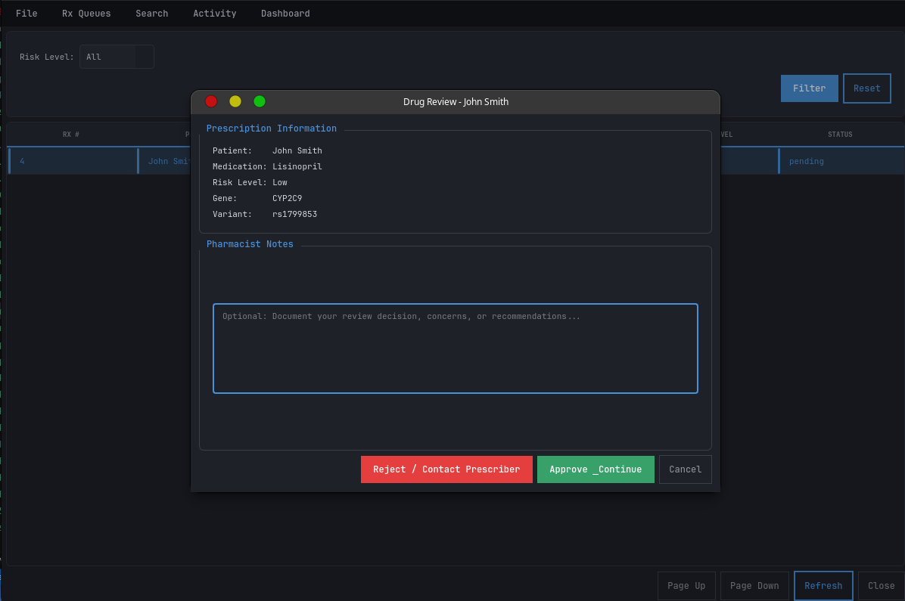

# Pharmacogenomic Software

Pharmacogenomic Software is designed to integrate pharmacogenomics (PGX) into patient pharmacy healthcare systems, enabling personalized medicine and safer, more effective drug therapy. This platform empowers clinicians and pharmacists to make informed decisions by leveraging genetic data alongside traditional patient information.

## Inspirations
The project is inspired by the growing need to bridge the gap between genetic research and practical healthcare. By incorporating PGX data, the software aims to reduce adverse drug reactions, optimize dosing, and improve patient outcomes. It draws from real-world pharmacy workflows, clinical decision support systems, and the latest advances in pharmacogenomics.

## PharmGKB Integration
This software leverages data and resources from [PharmGKB](https://www.pharmgkb.org/) to identify and present drug-genetic variant conflicts. PharmGKB enables the detection of clinically relevant gene-drug interactions, supporting safer prescribing and personalized therapy recommendations. We gratefully acknowledge PharmGKB for making this critical pharmacogenomic knowledge accessible.

## Architecture
The software is built with modularity and scalability in mind:
- **UI Layer:** Built with Python, providing intuitive widgets and views for patient management, prescription review, and workflow queues.
- **Service Layer:** Handles business logic, including prescription validation, drug review, and PGX data integration.
- **Database Layer:** Stores patient records, genetic profiles, prescription histories, and audit logs.
- **Integration:** Designed for easy connection to external PGX databases and healthcare systems.

## Features
- Secure login and authentication
- Patient profile management
- Drug review and approval workflow
- Prescription detail views
- Product selection and dispensing queues

### Nexus Controls

*Introduction:* Welcome to the Pharmacogenomic Software platform. This page introduces users to a secure environment where pharmacy professionals can access patient data, review prescriptions, and utilize genetic information to guide therapy. The login system ensures privacy and compliance with healthcare regulations.

### 1. Patient Profile

*Genomics Tab:* This tab provides a detailed visualization of the patient's pharmacogenomic profile, including actionable genetic variants, and gene-drug relationships. It empowers clinicians to quickly assess how a patient's genetics may impact drug response, risk of adverse effects, and optimal therapy selection. Clinicians are also able to add genetic variants here. The interface highlights clinically significant findings and links to supporting evidence.

*Drug Review Tab (Patient Profile):* This section summarizes all current and historical prescriptions for the patient, cross-referenced with their genetic data. It flags potential drug-gene interactions, provides genotype-based dosing guidance, and offers alerts for contraindications. The tab is designed to streamline the review process and ensure that every medication is evaluated in the context of the patient's unique genetic makeup.

### 2. Drug Review Page

*Description:* The drug review interface enables pharmacists to evaluate prescriptions in the context of patient genetics. It highlights potential drug-gene interactions, flags contraindications, and provides actionable recommendations. This robust workflow ensures that every prescription is optimized for safety and efficacy.

## Directory Structure
- `PNGS/` — Contains UI screenshots
- `config/` — Configuration files
- `db/` — Database scripts and migrations
- `ui/` — UI components and views
- `services/` — Backend service logic

## Contributing
1. Fork the repository
2. Create your feature branch (`git checkout -b feature/YourFeature`)
3. Commit your changes
4. Push to the branch
5. Open a pull request

## License
This project is licensed under the MIT License.

